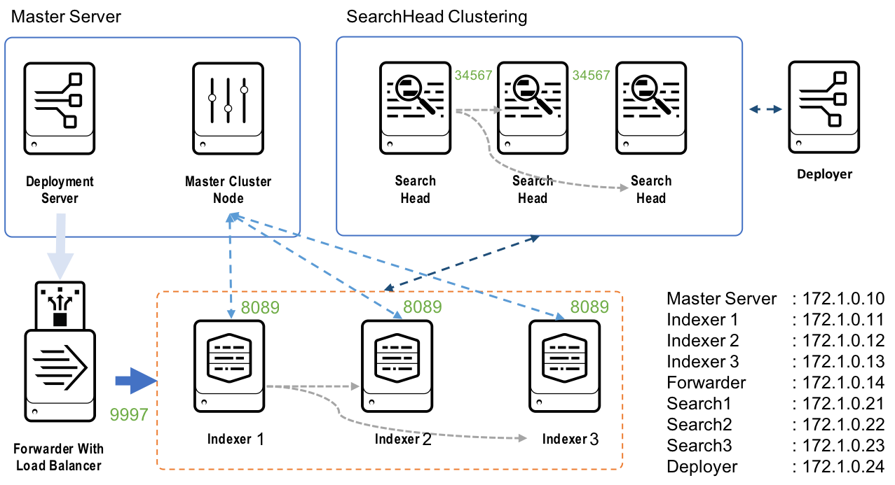

# Splun Docker를 이용한 테스트 환경 만들기

- 예전에 만들어 두었던 것입니다. (splunk version 6.6.1)
- 새 버전에는 테스트를 해 보지 않았지만 SPLUNK_PASSWORD 만 추가하면 가능 할 듯 합니다.


## 구성도




## 기능

3가지 파일로 구성되어 있습니다.

- docker-compose.yml : 기본 구성

- docker-compose_sh_cluster.xml : sh 용 vm 구성
- docker-compose_idx_cluster.yml : idx 용 vm 구성


Splunk docker site

- https://hub.docker.com/r/splunk/splunk/


## docker-compose 사용 법

- 처음 시작 시
```
docker-compose up -d
```

- 상태 확인
```
docker-compose ps
```

- 정지
```
docker-compose stop
```

## 완전 삭제
```
docker-compose rm -v
```

## 각 splunk에 접속하기
- docker 명령어를 이용해서 접근. 설정 볼 때 확인.
- master
```
dokcer exec -it master /bin/bash
```

- indexer1
```
dokcer exec -it indexer1 /bin/bash
```

- indexer2
```
dokcer exec -it indexer2 /bin/bash
```

- indexer3
```
dokcer exec -it indexer3 /bin/bash
```

- universalforwarder
```
dokcer exec -it fwd1 /bin/bash
```

## 파일 복사하기
```
docker cp <file> <splunk container>:<path>
```


### 참조
- 마지막 라인 삭제하기
```
sed -i '$ d' foo.txt
```
